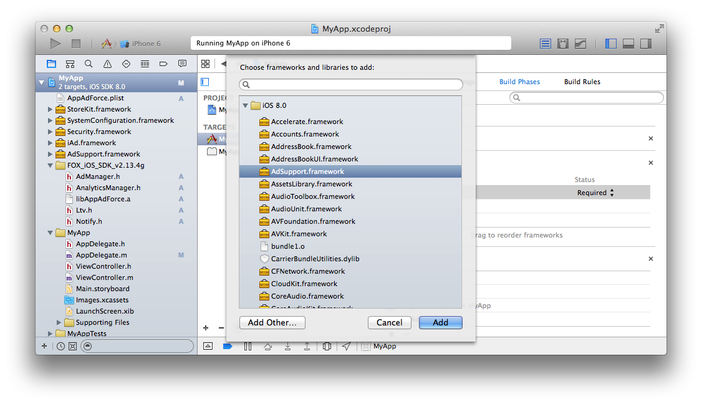
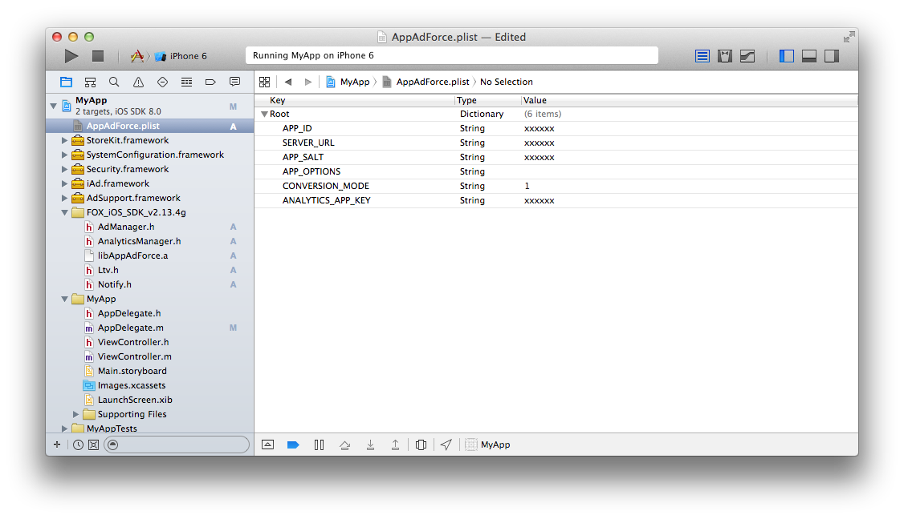

# Force Opetaion Xとは

Force Operation X (以下F.O.X)は、スマートフォンにおける広告効果最適化のためのトータルソリューションプラットフォームです。アプリケーションのダウンロード、ウェブ上でのユーザーアクションの計測はもちろん、スマートフォンユーザーの行動特性に基づいた独自の効果計測基準の元、企業のプロモーションにおける費用対効果を最大化することができます。

本ドキュメントでは、スマートフォンアプリケーションにおける広告効果最大化のためのF.O.X SDK導入手順について説明します。

## F.O.X SDKとは

F.O.X SDKをアプリケーションに導入することで、以下の機能を実現します。

* **インストール計測**

広告流入別にインストール数を計測することができます。

* **LTV計測**

流入元広告別にLife Time Valueを計測します。主な成果地点としては、会員登録、チュートリアル突破、課金などがあります。各広告別に登録率、課金率や課金額などを計測することができます。

* **アクセス解析**

自然流入と広告流入のインストール比較。アプリケーションの起動数やユニークユーザー数(DAU/MAU)。継続率等を計測することができます。


# 1.	概要

本ドキュメントでは、Force Operation X SDK Corona Enterprise プラグインのAndroidアプリ及び、iOSアプリへの導入手順について説明します。
また、Corona Enterprise未満のグレードには対応しておりません。

Force Operation X SDKでは、インストールおよびLTVの計測、アクセス解析を行うことができます。

SDKの実装後は、アプリケーションの動作及び効果測定の結果に問題のないことを確認した後にマーケットへの申請を行ってください。効果測定のテスト手順については、Force Operation X管理者よりご連絡いたします。

対象のスクリプトはLua/Java/Objective-Cになっております。
Androidに関してはLua上からForceOperationXSDK(Java)を呼び出す方法を記しております。

## 1.1	SDK仕様


F.O.X SDKをアプリケーションに導入することで、以下の機能を実現します。


|処理|必須|概要|
|:------:|:------:|:------|
|インストール計測|必須|起動時はブラウザが起動し、Cookie計測により広告効果測定を行います。<br>コンバージョン数、CVRなどを測定することができます。<br>メソッド名：sendConversion|
|LTV計測|オプション|任意の成果地点で成果通知を行い、広告別の課金数や入会数の計測を行います。<br>課金金額、退会数などを測定することができます。<br>メソッド名：sendLtv|
|アクセス解析|オプション|アプリの起動時およびバックグラウンドからの復帰時の起動計測を行います。<br>起動数、アクティブユーザー数(DAU)、継続率などを測定することができます。<br>メソッド名：sendStartSession|

## 1.2 ブラウザ起動について


Cookie計測による広告効果測定を行うためには、外部ブラウザを経由して成果通信を行う必要があります。管理画面上でブラウザ起動設定を行うことで、初回起動時にブラウザを起動させることができます。

# 2. Android用 プロジェクトの設定
## 2.1	SDKの展開

SDK「FOX_CoronaEnterprise_SDK_<version>.zip」ファイルをOS上に展開します。Androidフォルダに同梱されている「AppAdForce.jar」を開発環境に導入します。次に、Eclipseプロジェクトへの導入手順について説明します。


## 2.2 プロジェクトへの導入

EclipseプロジェクトへAppAdForce.jarを外部Jarとして追加します。
詳細な手順は以下の通りです。

* [Eclipseプロジェクトへの導入の方法](./doc/integration/eclipse/)


## 2.3 AndroidManifest.xmlの編集
### 2.3.1 パーミッションの設定

Force Operation X SDKの実行に必要なパーミッションの設定を<manifest>タグ内に追加します。

	<uses-permission android:name="android.permission.INTERNET" />
	<uses-permission android:name="android.permission.ACCESS_NETWORK_STATE" />
	<uses-permission android:name="android.permission.READ_EXTERNAL_STORAGE" />
    <uses-permission android:name="android.permission.WRITE_EXTERNAL_STORAGE" />	
### 2.3.2 メタデータの設定
|パラメータ名|必須|概要|
|:------|:------|:------|
|APPADFORCE_APP_ID|必須|Force Operation X管理者より連絡しますので、その値を入力してください。|
|APPADFORCE_SERVER_URL|必須|Force Operation X管理者より連絡しますので、その値を入力してください。|
|APPADFORCE_CRYPTO_SALT|必須|Force Operation X管理者より連絡しますので、その値を入力してください。|
|ANALYTICS_APP_KEY|必須|Force Operation X管理者より連絡しますので、その値を入力してください。|
|APPADFORCE_ID_DIR|オプション|内(外)部ストレージを利用する際、任意の保存するディレクトリ名を指定できます。<br>未指定の場合、パッケージ名でディレクトリが作成されます。|
|APPADFORCE_ID_FILE|オプション|内(外)部ストレージを利用する際、任意の保存する識別子ファイル名を指定できます。<br>未指定の場合、”__FOX_XUNIQ__”でファイルが作成されます。|
|APPADFORCE_USE_EXTERNAL_STORAGE|オプション|0を指定した場合、内(外)部ストレージへの保存は実行しません。|

Force Operation X SDKの実行に必要な情報を<application>タグ内に追加します。

	<meta-data android:name="APPADFORCE_APP_ID" android:value="1" />
	<meta-data android:name="APPADFORCE_SERVER_URL" android:value="012345ABC" />
	<meta-data android:name="APPADFORCE_CRYPTO_SALT" android:value="abcdef123" />
	<meta-data android:name="ANALYTICS_APP_KEY" android:value="xxxxxx" />


###2.3.3 インストールリファラー計測の設定
インストールリファラー計測を行うために必要な設定を<application>タグ内に追加します。

	<receiver android:name="jp.appAdForce.android.InstallReceiver" android:exported="true">
		<intent-filter>
			<action android:name="com.android.vending.INSTALL_REFERRER" />
		</intent-filter>
	</receiver>

既に"com.android.vending.INSTALL_REFERRER"に対するレシーバークラスが定義されている場合には、[二つのINSTALL_REFERRERレシーバーを共存させる場合の設定](./doc/install_referrer/)をご参照ください。


###2.3.4 AndroidManifest.xmlに関連するその他の設定
* [URLスキームの設定](./doc/config_url_scheme/)
* [（オプション）広告IDを利用するためのGoogle Play Services SDKの導入](./doc/google_play_services/)
* [（オプション）外部ストレージを利用した重複排除設定](./doc/external_storage/)
* [AndroidManifest.xmlの設定例](./doc/config_androidManifest/AndroidManifest.xml)


# 3. iOS用 プロジェクトの設定
## 3.1 SDKの展開

ダウンロードしたSDKのiOSディレクトリ内のファイルをOS上に展開します。SDKに同梱されているファイルは以下の通りです。

|ファイル名|必須|概要|
|:------:|:------:|:------|
|AdManager.h|必須|ヘッダファイル。広告の効果測定を行う。|
|libAppAdForce.a|必須|ライブラリファイル。広告の効果計測を行う。|
|Ltv.h|オプション|ヘッダファイル。LTV計測を行う。LTV計測を行わない際は組み込み不要。|
|AnalyticsManager.h|オプション|ヘッダファイル。アクセス解析を行う。|
|PluginFox.h|オプション|ヘッダファイル。CoronaEnterpriseからSDKを使用するためのラッパー|
|PluginFox.m|オプション|ライブラリファイル。CoronaEnterpriseからSDKを使用するためのラッパー|

本SDKは以下のアーキテクチャに対応しています。

* armv7
* armv7s
* arm64 (64bit)
* i386 (debug)

##3.2	ライブラリの組み込み

* Xcodeのメニュー「File」→「Add Files to “XXX”」を選択
* Cocos2dxFox.h、Cocos2dxFox.mmを組み込んでください。Cocos2dxFox.cppはAndroid用ライブラリであるため、追加の必要はありません。
* プッシュ通知機能を使う場合は、FoxNotifyPlugin.h、FoxNotifyPlugin.mの2ファイルを組み込んでください。
* バンドルバージョン判定機能を使う場合は、FoxVersionDelegate.h、FoxVersionDelegate .mmとFoxVersionPlugin.h、FoxVersionPlugin.mmの計4ファイルを組み込んでください。
* リエンゲージメント計測を行う場合はFoxReengagePlugin.hとFoxReengagePlugin.mの2ファイルを組み込んでください。
* 「Copy items into destination group’s folder」にチェック


[ライブラリの組み込み詳細](./doc/integration/)


##3.3 フレームワークの追加

次のフレームワークをプロジェクトにリンクしてください。

<table>
<tr><th>フレームワーク名</th><th>Status</th></tr>
<tr><td>AdSupport.framework</td><td>Optional</td></tr>
<tr><td>iAd.framework </td><td>Required</td></tr>
<tr><td>Security.framework </td><td>Required </td></tr>
<tr><td>StoreKit.framework </td><td>Required </td></tr>
<tr><td>SystemConfiguration.framework </td><td>Required </td></tr>
</table>

> AdSupport.frameworkはiOS 6以降で追加されたフレームワークのため、アプリケーションをiOS 5以前でも動作させる(iOS Deployment Targetを5.1以下に設定する)場合にはweak linkを行うために”Optional”に設定してください。



[フレームワーク設定の詳細](./doc/config_framework/README.md)

##3.4 SDKの設定

SDKの動作に必要な設定をplistに追加します。「AppAdForce.plist」というファイルをプロジェクトの任意の場所に作成し、次のキーと値を入力してください。

<table>
<tr>
  <th>Key</th>
  <th>Type</th>
  <th>Value</th>
</tr>
<tr>
  <td>APP_ID</td>
  <td>String</td>
  <td>Force Operation X管理者より連絡しますので、その値を入力してください。</td>
</tr>
<tr>
  <td>SERVER_URL</td>
  <td>String</td>
  <td>Force Operation X管理者より連絡しますので、その値を入力してください。</td>
</tr>
<tr>
  <td>APP_SALT</td>
  <td>String</td>
  <td>Force Operation X管理者より連絡しますので、その値を入力してください。</td>
</tr>
<tr>
  <td>APP_OPTIONS</td>
  <td>String</td>
  <td>何も入力せず、空文字の状態にしてください。</td>
</tr>
<tr>
  <td>CONVERSION_MODE</td>
  <td>String</td>
  <td>1</td>
</tr>
<tr>
  <td>ANALYTICS_APP_KEY</td>
  <td>String</td>
  <td>Force Operation X管理者より連絡しますので、その値を入力してください。<br />アクセス解析を利用しない場合は設定の必要はありません。</td>
</tr>
</table>



[SDK設定の詳細](./doc/config_plist/)

[AppAdForce.plistサンプル](./doc/config_plist/AppAdForce.plist)


# 4 インストール計測の実装
## 4.1 共通事項

初回起動のインストール計測を実装することで、広告の効果測定を行うことができます。初回起動時に、ブラウザを起動し、広告クリック時に付与されたCookieの情報を照合することで、成果の計測を行います。

初回起動時にブラウザを起動するために、main.lua等、アプリケーションの起動時に必ず呼ばれる箇所に効果測定用の処理を追加します。

**プラグインをインポート(Lua)**

	Local Fox = require "plugin.fox"

## 4.2 Androidへの組み込み

初回起動のインストール計測を実装することで、広告の効果測定を行うことができます。初回起動時に、ブラウザを起動し、広告クリック時に付与されたCookieの情報を照合することで、成果の計測を行います。

AppAdForce.jarに含まれているJavaライブラリをLuaから実行するためにCoronaApplication.javaのonLoadedメソッド内のNamedJavaFunctionインターフェースの配列に対象クラスを追記します。

**[Java記述例]**

クラスをインポート
```java
import jp.appAdForce.android.corona.CoronaAdManager;
```

成果通知実行クラスをNameJavaFunction配列に追加

```java
@Override
public void onLoaded(com.ansca.corona.CoronaRuntime runtime) {
    com.naef.jnlua.LuaState luaState = runtime.getLuaState();
    com.naef.jnlua.NamedJavaFunction[] luaFunctions;
    luaFunctions = new com.naef.jnlua.NamedJavaFunction[] {
        new CoronaAdManager.SendConversionWithStartPageUrl(),
    }
    luaState.register(“plugin.fox”, luaFunctions);
    luaState.pop(1);	
}
```
※registerメソッドの第一引数には、Luaから呼び出す際の名称であるため任意の文字列で設定が可能です。
ここでは「plugin.fox」を指定しています。

> 初回起動時にブラウザを起動するために、アプリケーションの起動時に必ず呼ばれる箇所に効果測定用の処理を追加してください。


**[Lua記述例]**

```lua
// プラグインの呼び出し
Local Fox = require "plugin.fox
Fox.sendConversion(”default”);
```

> ※defaultを指定しての初回起動時には標準の簡単なサンプルページが表示されますが、後からF.O.Xの管理画面上で遷移先URLもしくはHTMLページを弊社で設定いたします。遷移先ページからアプリへ戻すためのURLスキームが必要となりますので、マーケットへのリリースまでに弊社へURLスキーム名をご連絡ください。

* [sendConversionの詳細](./doc/send_conversion/)

## 4.3 iOSへの組み込み

**[Lua記述例]**

成果通知のコードを追加

```lua
// プラグインの呼び出し
Local Fox = require "plugin.fox
Fox.sendConversionWithStartPage(”default”);
```

> ※defaultを指定しての初回起動時には、標準の簡単なサンプルページが表示されますが、後からF.O.Xの管理画面上で遷移先URLもしくはHTMLページを弊社で設定いたします。
遷移先ページからアプリへ戻すためのURLスキームが必要となりますので、マーケットへのリリースまでに弊社へURLスキーム名をご連絡ください。


* [sendConversionの詳細](./doc/send_conversion/)


# 5 LTV計測の実装

LTV計測により、広告流入別の課金金額や入会数などを計測することができます。計測のために、任意の地点にLTV成果通信を行うコードを追加します。ソースの編集は、成果が上がった後に実行されるスクリプトに処理を記述します。例えば、会員登録やアプリ内課金後の課金計測では、登録・課金処理実行後のコールバック内にLTV計測処理を記述します。


## 5.1 共通事項

**プラグインをインポート**

	Local Fox = require "plugin.fox"


## 5.2 Androidへの組み込み

前述のインストールの計測と同様、AppAdForce.jarに含まれているJavaライブラリをLuaから実行するためにCoronaApplication.javaのonLoadedメソッド内のNamedJavaFunctionインターフェースの配列に対象クラスを追記します。

* CoronaLtvManagerクラス : アプリ内でのLTV計測を行う場合に追加
* CoronaLtvManger.AddLtvParamクラス : LTV計測に任意のパラメータを追加する場合に追加

**[Java記述例]**

```java
import jp.appAdForce.android.corona.CoronaLtvManager;
```

LTV成果計測実行クラスをNameJavaFunction配列に追加

```java
@Override
public void onLoaded(com.ansca.corona.CoronaRuntime runtime) {
    com.naef.jnlua.LuaState luaState = runtime.getLuaState();
    com.naef.jnlua.NamedJavaFunction[] luaFunctions;
    luaFunctions = new com.naef.jnlua.NamedJavaFunction[] {
        new CoronaAdManager.SendConversionWithStartPageUrl(),
        new CoronaLtvManager(),
        new CoronaLtvManager.AddLtvParam(),
    }
    luaState.register("plugin.fox", luaFunctions);
    luaState.pop(1);
}
```


上記のJavaを実装した上で、成果がアプリ内部で発生する場合、成果処理部に以下のように記述してください。

**[Lua記述例]**
```lua
// プラグインの呼び出し 
Local Fox = require "plugin.fox"
Fox.sendLtvConversion(成果地点ID)
```

> 成果地点ID(必須)：管理者より連絡します。その値を入力してください。


* [sendLtvConversionの詳細](./doc/send_ltv_conversion/)


## 5.3 iOSへの組み込み

成果がアプリ内部で発生する場合、成果処理部に以下のように記述してください。

**[Lua記述例]**

```lua
// プラグインの呼び出し
Local Fox = require "plugin.fox"
Fox.sendLtv(“成果地点ID”);
```

> 成果地点ID(必須)：管理者より連絡します。その値を入力してください。

* [sendLtvConversionの詳細](./doc/send_ltv_conversion/)


# 6 アクセス解析 

アクセス解析を導入することで、自然流入・広告流入別の起動数、アクティブユーザー数(DAU/MAU)や継続率を計測することができます。アクセス解析では、アプリケーションが起動、もしくはバックグラウンドから復帰する際にセッション計測を行うコードを追加します。


## 6.1 Androidへの組み込み


### 6.1.1 起動計測の実装

**アクセス解析の導入方法はCoronaApplication.javaに実装する方法と、Lua上に実装する方法の２つがあります。開発が容易な方どちらか１つをお使いください。**

#### Java上でアクセス解析処理を実行

CoronaApplication.javaに以下の実装を行います。


クラスをインポート

```java
import jp.appAdForce.android.AnalyticsManager;
```

アプリケーション起動時の起動計測(MainActivityクラスへの実装例)

```java
@Override
public void onStarted() {
Final Activity activity = com.ansca.corona.CoronaEnvironment.getCoronaActivity();
activity.runOnUiThread(new Runnable() {
	Public void run() {
		AnalyticsManager.sendStartSession(activity);
	}
});
}
```

> ※AnalyticsManager.sendStartSessionメソッドをJava上で実行する際は必ずUIスレッド内で実行されるようご実装ください。


#### Lua上でアクセス解析処理を実行

Lua上でアクセス解析処理を実行する場合は次の処理を実装します。その際は上記のJavaによる実行は実装しないでください。
前述のLTVの計測と同様、AppAdForce.jarに含まれているJavaライブラリをLuaから実行するためにCoronaApplication.javaのonLoadedメソッド内のNamedJavaFunctionインターフェースの配列に対象クラスを追記します。

* CoronaAnalyticsManagerクラス : アプリケーションの起動及び、バックグラウンドからの復帰を計測する時に追加

**[Java記述例]**

クラスをインポート

```java
import jp.appAdForce.android.corona.CoronaAnalyticsManager;
```
起動計測実行クラスをNameJavaFunction配列に追加

```java
@Override
public void onLoaded(com.ansca.corona.CoronaRuntime runtime) {
    com.naef.jnlua.LuaState luaState = runtime.getLuaState();
    com.naef.jnlua.NamedJavaFunction[] luaFunctions;
    luaFunctions = new com.naef.jnlua.NamedJavaFunction[] {
        new CoronaAdManager.SendConversionWithStartPageUrl(),
        new CoronaLtvManager(),
        new CoronaAnalyticsManager(),
    }
    luaState.register("plugin.fox", luaFunctions);
    luaState.pop(1);
}
```

Luaプログラム上の、アプリケーションの起動及び、バックグラウンドからの復帰時に必ず実行される箇所に以下の
コードを記述します。iOSは下記のLuaでの実装のみで結構です。
**[Lua記述例(Android/iOS共通)]**
```lua
// プラグインをインポート
Local Fox = require "plugin.fox"
FOX.sendStartSession();
```

> ※sendStartSession()が実行される度に、アプリを起動したと見なし起動カウント処理が実行されます。処理の重複実行にご注意ください。正確なアクティブユーザー数が計測できなくなります。
※JavaのonStarted()、onResumed()とLuaのスクリプト上の両方でsendStartSession()が実行されていた場合、１ユーザーから２重にアプリ起動情報が送信されるため必ずどちらかで実装してください。

[アクセス解析によるイベント計測](./doc/analytics_event/)


# 7 AndroidプロジェクトでProGuardを利用する場合

ProGuardを利用してF.O.X SDKを導入したアプリケーションを難読化する際に、警告が発生する場合があります。その際には、警告を回避するため以下の設定を追加してください。

	-libraryjars libs/AppAdForce.jar
	-keep interface jp.appAdForce.** { *; }
	-keep class jp.appAdForce.** { *; }
	-keep class jp.co.dimage.** { *; }
	-keep class com.google.android.gms.ads.identifier.* { *; }
	-dontwarn jp.appAdForce.android.ane.AppAdForceContext
	-dontwarn jp.appAdForce.android.ane.AppAdForceExtension
	-dontwarn com.adobe.fre.FREContext
	-dontwarn com.adobe.fre.FREExtension
	-dontwarn com.adobe.fre.FREFunction
	-dontwarn com.adobe.fre.FREObject
	-dontwarn com.ansca.**
	-dontwarn com.naef.jnlua.**

※GooglePlayServiceSDKを導入されている場合、以下のページで記載されているkeep指定が記述されているかご確認ください。

[Google Play Services導入時のProguard対応](https://developer.android.com/google/play-services/setup.html#Proguard)


# 8 疎通テストの実施

マーケットへの申請までに、Force Operation Xを導入した状態で十分にテストを行い、アプリケーションの動作に問題がないことを確認してください。

効果測定テストの手順については、管理者よりご連絡いたしますのでその手順に従いテストを実施してください。

成果のための通信は、起動後に一度のみ行わるため、二回目以降の起動では通信が発生しません。続けて効果測定テストを行いたい場合には、アプリケーションをアンインストールし、再度インストールから行ってください。


## 8.1 テストの手順

SDKが正常に導入されていることを確認するためのテスト手順は以下の通りです。
ProGuardを掛けてリリースを行う場合、必ずProGuardを掛けた状態でテストの実施をお願い致します。

1. テスト用端末にテストアプリがインストールされている場合には、アンインストール
2. テスト用端末の「設定」→「Safari」→「Cookieとデータを消去」によりCookieを削除
3. 弊社より発行したテスト用URLをクリック<br>
   ※ テスト用URLは必ずOSに設定されているデフォルトブラウザでリクエストされるようにしてください。
デフォルトブラウザとは、URLをクリックした際に自動で起動するブラウザのことです。
メールアプリやQRコードアプリを利用され、そのアプリ内WebViewで遷移した場合には計測できません。
4. マーケットへリダイレクト<br>
   ※ テストURLの場合には、遷移先がなくエラーダイアログが表示される場合がありますが、問題ありません。
5. テスト用端末にテストアプリをインストール
6. アプリを起動、ブラウザが起動<br>
   ※ ここでブラウザが起動しない場合には、正常に設定が行われていません。
設定を見直していただき、問題が見当たらない場合には弊社へご連絡ください。
7. LTV地点まで画面遷移
8. アプリを終了し、バックグラウンドからも削除
9. 再度アプリを起動
10. 弊社へ3,6,7,9の時間をお伝えください。正常に計測が行われているか確認致します。
11. 弊社側の確認にて問題がなければテスト完了となります。

#9 最後に必ずご確認ください（これまで発生したトラブル集）

###URLスキームの設定がされずリリースされたためブラウザからアプリに遷移ができない

Cookie計測を行いブラウザを起動した場合には、URLスキームを利用してアプリケーションに遷移します。

この際、独自のURLスキームが設定されている必要があります。


###URLスキームに大文字が含まれ、正常にアプリに遷移されない

環境によって、URLスキームの大文字小文字が判別されないことにより正常にURLスキームの遷移が行えない場合があります。

URLスキームは全て小文字で設定を行ってください。






