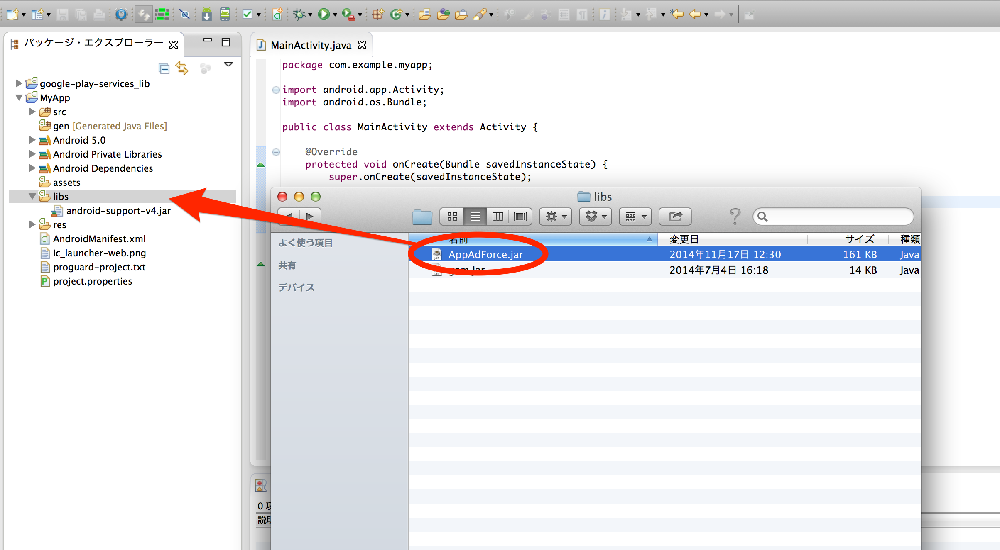

### Eclipseプロジェクトへの導入

EclipseプロジェクトへAppAdForce.jarを外部jarとして追加する方法は以下の通りです。

* アプリケーションプロジェクトの「libs」フォルダー配下にAppAdForce.jarをコピー

* Androidプロジェクトの「libs」フォルダー配下にAppAdForce.jarをコピー
* Androidプロジェクトを選択し、右クリック→「プロパティー」を選択
* 左のメニューから「Javaのビルド・パス」を選択
* 右側のメイン画面にある「ライブラリー」タブを選択
* メイン画面の右側にある「外部Jar追加」を選択
* Androidプロジェクトの「libs」フォルダーに配置した「AppAdForce.jar」を選択
* メイン画面に「AppAdForce.jar」が表示されていることを確認

